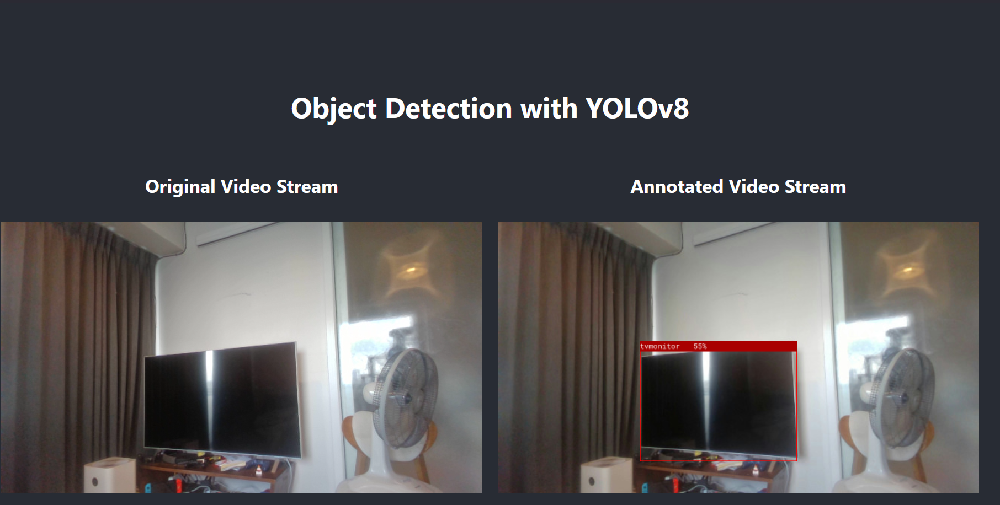
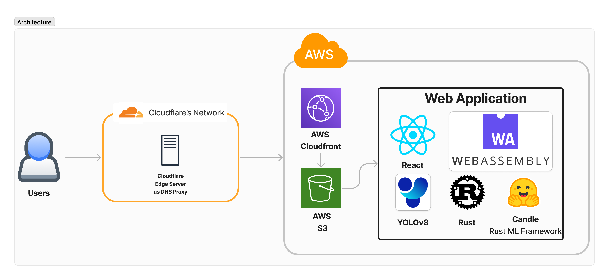

# 🚀 Overview

>🔥 Simple Web application for YOLOv8 Object Detection using **React + Rust's WebAssembly**!  

The web application is run & rendered purely on client-side 🖥️ without transferring any data out to the public internet, so no need to worry! 

The YOLOv8 model is backed by Rust programming language compiled into WebAssembly 🎉 which is imported and modified from 🕯️[candle](https://github.com/huggingface/candle) repository. Below is the example of webapp:

_Note that, the web app seems to have the most performance on firefox._

# Get started
1. cd into project directory root and run `npm install` to install all of the required React pacakge
2. run `npm run build:wasm` to build webassembly artifact  
3. run `npm run start` to test locally 
4. run `npm run build` to build the deployable artifact

> 🧑‍💻 You can also visit <a href="https://yolo.crypto-bot-gcp.trade" target="_blank" rel="noopener noreferrer"> yolo.crypto-bot-gcp.trade </a> for my web application demo!

# Architecture for the web application
Below is the simple architecture for this web application:
1. Users will access the domain hosted on **Cloudflare**
2. The request will be routed through **Cloudflare infra** and proxied to **AWS Cloudfront**
3. **AWS Cloudfront**, then, will fetch the website content from **AWS S3** into users' browser
4. HTML, Javascript, and WASM will be rendered at users' browser for real time Object Detection with the following as a main components:  
    4.1 **Candle** ML Framework in *Rust* compiled to **WebAssembly** as a main inference engine  
    4.2 **Yolo v8** as the main Obeject Detection Model  
    4.2 **React** as a main rendering UI  
    4.3 **react-webcam** for streaming video frame from webcam

